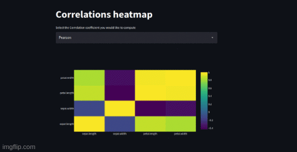

I've created this webapp for the ondes that are not used to work with a programming language and would like to do some EDA. It was made using Streamlit and Plotly, and it computes since from descriptive statistics to correlation heatmaps. Hope it can be helpful :)

